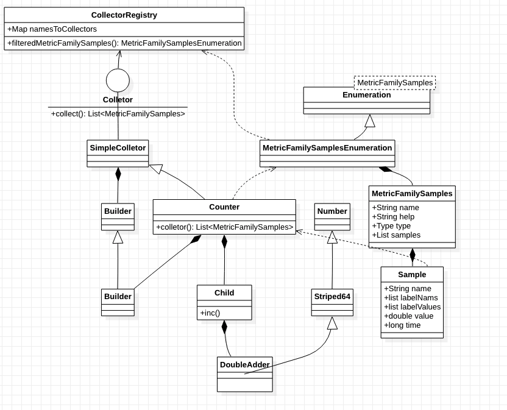

# Prometheus

## 简介

Prometheus的核心数据模型是时间序列，因此它非常适合记录时间序列数据，并根据记录的时间序列进行相关的聚合和分析操作。

## 数据模型（以Counter和Gauge为例）

| 指标名                       | 标签值                    | 指标值float64 | 时间戳/ms  |
| ---------------------------- | ------------------------- | ------------- | ---------- |
| device_listener_count_metric | bundleId="123",type="xxx" | 15            | 1563517260 |

1. 指标名+标签值唯一决定一个值序列
2. 数据结构上类似于一个两级的map 指标名为key1，一组标签为key2，float64值为值

## 指标模型

Counter, Gauge, Histogram, Summary

1. Counter保存只增不减
2. Gauge保存可以改变的值

## 客户端简单使用 以device-listener为例

### client

```xml
<dependency>
    <groupId>io.prometheus</groupId>
    <artifactId>simpleclient</artifactId>
    <version>${prometheus.client.version}</version>
</dependency>
<dependency>
    <groupId>io.prometheus</groupId>
    <artifactId>simpleclient_common</artifactId>
    <version>${prometheus.client.version}</version>
</dependency>
```

### 流程

1. 接口注册：把device-listener/device-listener.stream注册到consul

2. Controller注册：自定义controller(如Counter)到 `CollectorRegistry.defaultRegistry`

3. 监控指标写入：counter维护了Map<labels, child>的集合，每个child存了一个值
  
    ```java
    //counter是一个注册了的Counter
    counter.labels(bundleId, type)//返回一个child
        .inc();
    ```

4. 拉取：prometheus 通过 device-listener/device-listener.stream 从servlet中`CollectorRegistry.defaultRegistry`的拉取数据

   ```java
       protected void doGet(final HttpServletRequest req, final HttpServletResponse resp)
               throws ServletException, IOException {
           resp.setStatus(HttpServletResponse.SC_OK);
           resp.setContentType(TextFormat.CONTENT_TYPE_004);
           Writer writer = resp.getWriter();
           try {
             	//从registry拉取数据 就是同一个CollectorRegistry.defaultRegistry
               TextFormat.write004(writer, registry.filteredMetricFamilySamples(parse(req)));
               writer.flush();
           } finally {
               writer.close();
           }
       }
   ```

## 展示

1. 可以通过HTTP api读取 /api/v1/query和/api/v1/query_range查询表达式当前或者一定时间范围内的计算结果
2. 在grafana通过PromQL读取

## java sdk

1. 注册器CollectorRegistry
2. 收集器Colletor
3. 样本MetricFamilySamples

### 相关类图



### 收集器SimpleCollector

#### 基础结构

1. Builder构造器:
    1. 用于构造SimpleCollector和注册到CollectorRegistry
    2. name和help必须存在
    3. 也可注册labels
2. `ConcurrentMap<List<String>, Child> children`
    1. Child是每个特定的Collector的执行器，保存了当前的数据
    2. map的key `List<String>`是lables，如前面所说，name决定collector，加上labels，就可以决定一个Child(即一个值)
3. `List<MetricFamilySamples> collect()`
    1. 返回Collector下所有的metric数据

#### 特定收集器

> 具体的收集器有Counter, Gauge, Histogram, Summary四种，均继承了SimpleCollector，重写自己的构造器Builder，拥有自己的计数单元Child, 实现自己的采样方法`List<MetricFamilySamples> collect()`

##### 简单collector(Counter和Gauge)

1. Counter, 提供inc()方法，数值只增不减
2. Gauge和Counter很类似，但可以自己设置值，多了一个Timer可以对Runnable或者`Callable<E>`进行时间的计算
3. 以上两种在同一个name，同一组label下均只有一个值，且不支持对值设置时间戳
   1. `collector.name = device_listener_count_metric`
   2. `collector.children = Map<List<String>, Child>`
   3. children的一个entry举例, `key ["123","xxx"],value: 16`
4. collect方法就是将name, labels, value的值构造成samples

##### Histogram 适合对输入数据做分布的分析

1. Child存了一组数作为区间上限。例如区间数为1,3,5；记录区间为x<=1, 1<x<=3, 3<x<=5
2. `Child.observe(double num)` 会输入num对应区间的数字计数
3. collect方法会返回三组samples,
   1. 比如每个区间现在输入了0.1, 2.5, 4.4，分别对应到每一个区间
   2. 返回的sample
      1. <le,1> 1; <le, 3> 2; <le, 5> 3; 累加值
      2. count: 返回最后一个区间的累加值3
      3. sum: 返回所有输入数的和0.1+2.5+4.4=7
4. Histogram也不支持对时间戳进行设置
